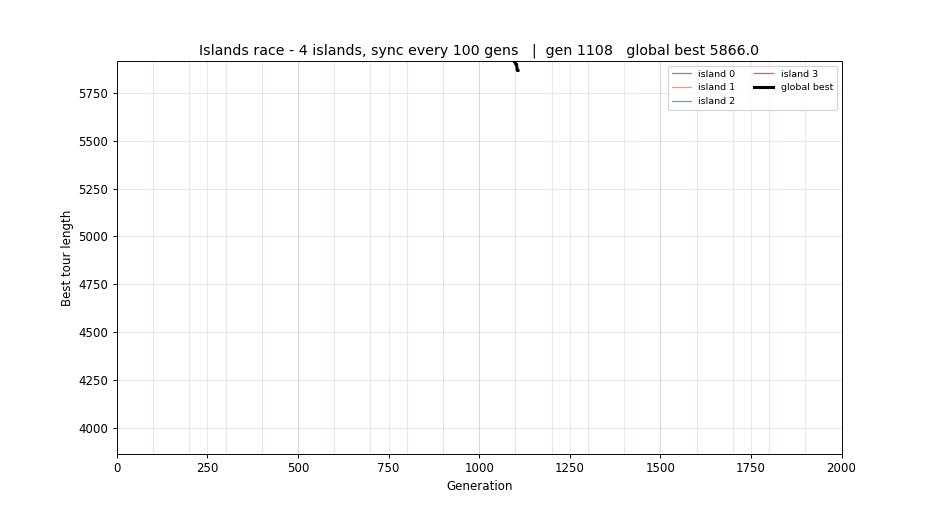

# Parallel TSP - Island-model Genetic Algorithm on an MPI cluster

Solve the Travelling Salesman Problem with an **island-model Genetic Algorithm**,
parallelized with **MPI (OpenMPI)** across a cluster of up to **4 nodes**.

The whole solver - the GA and all parallelization - is written in **C++**.
**Python is used only for visualization, the live demo, and plotting the report figures.**

## Repository layout

```
cpp/        C++ source: GA core, local search, MPI island solver, sequential baseline, tests
python/     visualization & plotting only (no algorithm): live_view, visualize, benchmark, experiments
data/       city coordinates + a small generator
cluster/    install / ssh / sync scripts, hostfiles, and the MPI launchers
results/    generated figures (PNG) and CSVs
report/     report.docx + source archive
```

## Parallel design

Each MPI process is an independent **island** running its own GA with its own seed, so the
islands explore different regions of the search space in parallel. They share results
periodically:

1. **Partial global-best migration (every `--sync` generations).** `MPI_Allreduce(MINLOC)`
   finds the single best tour across all islands; its owner `MPI_Bcast`s it. Rather than
   cloning that whole tour into every island (which collapses diversity), each other island
   splices only a random contiguous **segment** of it into `--migrants` of its individuals via
   OX crossover (segment from the best, the rest from a random local individual). Good
   sub-routes spread, but random cut points + different local mates keep every island distinct
   so diversity is preserved.
2. **Convergence stop.** Because the global best is identical on every rank at each sync, all
   ranks can agree to **stop together** once it has not improved for `--patience` generations -
   no extra communication, no deadlock.
3. **Baseline.** `--sync 0` disables sharing entirely (embarrassingly parallel; also disables
   the early stop) - useful as the "no communication" comparison in the report.

The final global best is gathered with `MPI_Allreduce(MINLOC)` and sent to rank 0.

## Setup - which environment, and when

The solver is C++ + MPI, so it **builds and runs on Linux**. There are three setups; pick by
what you are doing. Each lives in its own folder.

| You want to...                         | Where                              | Setup files                          | Build / run with |
|----------------------------------------|------------------------------------|--------------------------------------|------------------|
| Develop / run on one machine           | A Linux box, or **WSL** on Windows | `cpp/Makefile`, `cpp/BUILD.txt`      | `cd cpp && make`, then `mpirun -np N ./cpp/tsp_island ...` |
| Run the real multi-node experiments    | 4 Ubuntu nodes on a LAN            | `cluster/*.sh`, `cluster/hosts*`     | `cluster/01_install.sh` -> ... -> `cluster/run_cluster.sh` |
| Only view results / demos / make plots | Any OS (Windows native is fine)    | `requirements.txt`                   | `pip install -r requirements.txt`, then `python3 python/...` |

### 1. C++ build - the solver (`cpp/`)

Needed everywhere the solver runs. Requires **OpenMPI (`mpicxx`) + a C++17 compiler**
(`sudo apt install openmpi-bin libopenmpi-dev build-essential` on Ubuntu).

```bash
cd cpp
make            # builds tsp_island (MPI) + tsp_sequential (baseline)
make test       # builds and runs the unit tests (no MPI needed)
make clean
```

If `mpicxx` is not on your PATH (e.g. a source build under `/opt`), point `CXX` at it:

```bash
make CXX=/opt/openmpi-5.0.9/bin/mpicxx
```

See `cpp/BUILD.txt` for the manual one-off compile commands.

### 2. Single machine / WSL (local development)

- **Native Linux:** do the `cpp/` build above, then run with `mpirun --oversubscribe -np N ...`
  (see [Run](#run)). `bash cluster/run_local.sh` builds + runs in one step.
- **Windows:** the solver cannot build natively - use **WSL** (Ubuntu). Inside WSL it is just
  a Linux box: install OpenMPI, build `cpp/`, run with `mpirun`. The repo is reachable at
  `/mnt/c/...`. This machine's WSL already has OpenMPI **5.0.9** at `/opt/openmpi-5.0.9`, but
  its system `mpicxx` wrapper is broken (no dev headers), so build and run with that prefix:
  ```bash
  export PATH=/opt/openmpi-5.0.9/bin:$PATH
  export LD_LIBRARY_PATH=/opt/openmpi-5.0.9/lib
  make -C cpp CXX=/opt/openmpi-5.0.9/bin/mpicxx
  mpirun --oversubscribe -np 4 ./cpp/tsp_island data/cities_50.txt --gens 500 --sync 20
  ```
  (Note: WSL's `/tmp` is wiped between separate shell sessions - build and run in one shell.)
- **Plotting on Windows** can run with native Python (e.g. Anaconda) instead of WSL - the GUI
  window is more reliable than WSLg. `demo.bat` / `demo_parallel.bat` do exactly this: solver
  in WSL, viewer in Windows Python.

### 3. Cluster - 4 nodes (`cluster/`)

For the real multi-node experiments. Full requirements + step-by-step are in
[Cluster (4 nodes, LAN)](#cluster-4-nodes-lan) below. On the nodes themselves (Ubuntu) this is
**native Linux - no WSL**; WSL is only the Windows-dev stand-in for a Linux box.

### 4. Visualization deps - Python (`requirements.txt`)

Only `numpy` + `matplotlib` (no `mpi4py` - Python never touches MPI here).

```bash
pip install -r requirements.txt
```

## Run

```bash
# one machine, 4 islands, sharing every 20 generations
mpirun --oversubscribe -np 4 ./cpp/tsp_island data/cities_50.txt --gens 500 --sync 20

# stop early once the global best stalls for 200 generations
mpirun --oversubscribe -np 4 ./cpp/tsp_island data/cities_50.txt --gens 5000 --sync 20 --patience 200

# baseline: no result sharing
mpirun --oversubscribe -np 4 ./cpp/tsp_island data/cities_50.txt --gens 500 --sync 0

# convenience wrapper (builds if needed, single machine)
bash cluster/run_local.sh 4 data/cities_50.txt --gens 500 --sync 20
```

Key flags: `--gens`, `--pop`, `--sync` (migration interval, `0` = off), `--migrants`
(individuals recombined with the global best per sync; default 3 - higher = more mixing,
less diversity), `--patience` (stop after this many stalled generations, `0` = off),
`--twoopt` (2-opt memetic period), `--seed`, `--auto-balance`,
`--out tour.txt` (also writes `tour.txt.history`), `--stats file.csv`, `--live stream.jsonl`.

## Cluster (4 nodes, LAN)

### Requirements for a stable OpenMPI connection

For ranks on different machines to connect and stay connected, every node needs:

- **A shared LAN with mutual reachability** - all nodes on the same network, able to `ping`
  each other directly. (Internet alone does not work: MPI opens node-to-node TCP on random
  high ports, which NAT/firewalls block.)
- **Password-less SSH** (key-based) from the launcher (node1) to every node - mpirun starts
  remote ranks over SSH.
- **The same OpenMPI version at the same path** on every node (here 5.0.9 in
  `/opt/openmpi-5.0.9`); a version mismatch causes PMIx errors.
- **The same Linux username** on each node (mpirun SSHes as the same user by default).
- **The same `/etc/hosts` IP -> name mapping** on every node (template: `cluster/hosts.sample`).
- **The same code on the same branch at the same path** (`~/parallel-tsp`), rebuilt on each
  node - the compiled binary is not portable, so run `cd cpp && make` on every node. The data
  files must also exist on every node at the same relative path (`cluster/03_sync_code.sh`
  syncs the tree).
- **The firewall open between nodes** (or disabled on a trusted LAN), so MPI's ports are not
  blocked - otherwise mpirun hangs.

Clock sync, internet access, and identical hardware are *not* required.

### Steps

1. On every node: `bash cluster/01_install.sh` (OpenMPI, build tools, rsync, ssh).
2. Map node names to IPs: copy `cluster/hosts.sample`, replace the IPs with your real ones
   (`hostname -I` on each box), and append the four lines to `/etc/hosts` on **every** node.
   Changing the LAN/IPs later means editing only this mapping.
3. Set up password-less ssh (`cluster/02_ssh_setup.sh`) and sync the code
   (`cluster/03_sync_code.sh`).
4. Launch from node1:

```bash
bash cluster/run_cluster.sh cluster/hosts 4 ./cpp/tsp_island data/cities_50.txt --gens 500 --sync 20
```

`run_cluster.sh` uses `--map-by seq --bind-to none` so heterogeneous nodes (different core
counts) work, and pins the launch agent so all nodes use the same OpenMPI build.

## Visualization & report figures (Python)

Needs the plotting deps from [Setup step 4](#4-visualization-deps---python-requirementstxt)
(`pip install -r requirements.txt`). All of these read files the C++ solver wrote, so they
run anywhere - including native Windows Python.

On Windows, double-click **`demo.bat`** for a one-click interactive demo: it builds + runs the
C++ solver in WSL (streaming `--live`) and opens a native window that replays the search from
generation 1 (messy tangle -> clean route). The viewer replays at `--step` generations per
frame, so it works even though C++ converges in ~1 second.

### Parallelism demo - "islands race"

Each MPI rank is an independent island. Run the solver with `--out`, and **every** rank writes
its own convergence history (`<prefix>.rankN.history`, no extra MPI communication). The viewer
overlays them - one curve per island plus the bold **global best**, with green markers at each
sync - so you watch the islands search in parallel and pull toward the shared best:



```bash
# 4 islands, write per-rank histories, then watch the race:
mpirun --oversubscribe -np 4 ./cpp/tsp_island data/cities_500.txt --gens 2000 --sync 100 --out results/race
python3 python/live_view.py race results/race --sync 100
# or, on Windows, double-click demo_parallel.bat
```

```bash
# Live demo (launches the C++ solver locally and animates it):
python3 python/live_view.py run data/cities_30.txt --islands 4 --gens 400 --sync 20

# Live view of a REAL cluster run:
#   window 1 (head node): mpirun --hostfile cluster/hosts -np 4 ./cpp/tsp_island \
#                         data/cities_30.txt --gens 400 --sync 20 --live results/stream.jsonl
#   window 2:             python3 python/live_view.py tail results/stream.jsonl data/cities_30.txt

# Static figures from a finished run:
mpirun --oversubscribe -np 4 ./cpp/tsp_island data/cities_50.txt --gens 500 --sync 20 --out results/tour.txt
python3 python/visualize.py route data/cities_50.txt results/tour.txt --out results/route.png
python3 python/visualize.py converge results/tour.txt.history --out results/converge.png

# Speedup / size / granularity experiments (drives the C++ binary, then plots):
python3 python/experiments.py speedup --procs 1 2 4 8 --size 200
bash cluster/run_report_experiments.sh            # all three at once
```

## Tests

```bash
cd cpp && make test     # unit tests for the GA operators and the 2-opt / Or-opt local search
```
