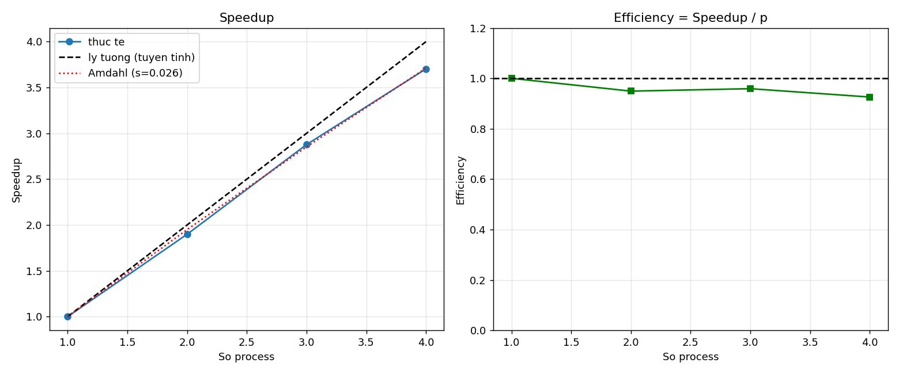

# Giải thuật Di truyền Mô hình Đảo cho Bài toán Người Giao Hàng trên Cụm MPI

**Môn:** Lập trình song song — Đồ án cuối kỳ
**Nhóm:** _(điền tên nhóm)_ — 4 thành viên
**Chủ đề:** Island-model Genetic Algorithm (GA) giải Travelling Salesman Problem (TSP),
song song hóa bằng MPI trên cụm 3 máy Ubuntu.

---

## Mục lục
1. Đặt vấn đề
2. Bài toán TSP và Giải thuật Di truyền tuần tự
3. Chiến lược song song hóa (mô hình Đảo + Di cư vòng Ring)
4. Kiến trúc cụm MPI
5. Kết quả thực nghiệm (chất lượng nghiệm + speedup/efficiency)
6. Khó khăn và cách khắc phục
7. Kết luận
8. Phụ lục: cách chạy lại

---

## 1. Đặt vấn đề

**TSP (Travelling Salesman Problem):** cho N thành phố và khoảng cách giữa chúng, tìm
một lộ trình khép kín đi qua **mỗi thành phố đúng một lần** sao cho **tổng quãng đường
ngắn nhất**. TSP là bài toán **NP-hard**: số lộ trình khả dĩ là (N−1)!/2, với N=50 đã
là ~3×10⁶² khả năng — không thể duyệt hết. Vì vậy ta dùng **giải thuật metaheuristic**
(Giải thuật Di truyền) để tìm nghiệm tốt trong thời gian chấp nhận được.

**Vì sao song song?** GA cần một quần thể lớn và nhiều thế hệ để tìm nghiệm tốt → tốn
thời gian. Mô hình **Đảo (Island model)** cho phép chia quần thể thành nhiều đảo chạy
**đồng thời** trên nhiều máy, đồng thời **di cư** cá thể tốt giữa các đảo để tăng chất
lượng nghiệm. Đây vừa là bài toán thú vị, vừa thể hiện rõ kỹ thuật song song hóa thật
sự (không phải chia việc tầm thường).

---

## 2. Bài toán TSP và Giải thuật Di truyền tuần tự

### 2.1. Biểu diễn
- **Cá thể (nhiễm sắc thể):** một hoán vị của `0..N−1` — thứ tự thăm các thành phố.
- **Độ thích nghi (fitness):** nghịch đảo độ dài lộ trình; lộ trình càng ngắn càng tốt.
- **Độ dài lộ trình:** tổng khoảng cách Euclid giữa các thành phố liên tiếp, có quay về
  điểm đầu (khép kín).

### 2.2. Các toán tử di truyền
| Toán tử | Mô tả | Vì sao chọn |
|---|---|---|
| **Khởi tạo** | Sinh ngẫu nhiên các hoán vị | Đa dạng quần thể ban đầu |
| **Chọn lọc giải đấu (tournament)** | Lấy ngẫu nhiên k cá thể, giữ cá thể tốt nhất | Đơn giản, áp lực chọn lọc điều chỉnh được qua k |
| **Lai ghép thứ tự (Order Crossover - OX)** | Giữ một đoạn của cha 1, điền phần còn lại theo thứ tự cha 2 | Bảo toàn **tính hợp lệ của hoán vị** (không trùng/thiếu thành phố) |
| **Đột biến (swap + đảo đoạn 2-opt)** | Đổi chỗ 2 thành phố và/hoặc đảo ngược một đoạn | Thoát cực trị cục bộ; đảo đoạn giúp gỡ các cạnh chéo |
| **Giữ tinh hoa (elitism)** | Luôn giữ lại cá thể tốt nhất sang thế hệ sau | Đảm bảo nghiệm không bao giờ xấu đi |

### 2.3. Vòng tiến hóa (mã giả)
```
khởi tạo quần thể ngẫu nhiên
lặp qua từng thế hệ:
    sắp xếp quần thể theo độ dài tour
    giữ lại cá thể tinh hoa
    lặp đến khi đủ quần thể mới:
        cha1 = chọn lọc giải đấu
        cha2 = chọn lọc giải đấu
        con  = lai ghép OX(cha1, cha2)
        đột biến(con)
        thêm con vào quần thể mới
    cập nhật độ dài; ghi lại tour tốt nhất
```

Mã nguồn: `python/ga_core.py` và `cpp/ga_core.hpp` (cùng thuật toán, hai ngôn ngữ).

---

## 3. Chiến lược song song hóa

### 3.1. Mô hình Đảo (Island model)
Mỗi **process MPI = một hòn đảo** mang một quần thể con, chạy GA **độc lập** với một
**seed ngẫu nhiên khác nhau**. Vì khởi đầu khác nhau, các đảo khám phá những vùng khác
nhau của không gian nghiệm → tăng tính đa dạng toàn cục.

### 3.2. Di cư theo vòng Ring (phần cốt lõi)
Cứ sau mỗi **K thế hệ** (mặc định K=20), mỗi đảo gửi **bản sao cá thể tốt nhất** của
mình sang **đảo kế bên theo vòng tròn** (rank → rank+1), và nhận cá thể từ đảo phía
trước (rank−1), rồi **thay thế cá thể tệ nhất** của mình bằng "khách" di cư.

```
   Đảo 0  ──►  Đảo 1  ──►  Đảo 2 ──┐
     ▲                              │
     └──────────────────────────────┘   (vòng ring)
```

**Cài đặt bằng `MPI_Sendrecv`:** gửi và nhận **đồng thời** trong một lời gọi.
Nếu dùng `Send` rồi `Recv` riêng lẻ, mọi đảo cùng chờ gửi → **deadlock**. `Sendrecv`
giải quyết triệt để vấn đề này trên cấu trúc vòng.

### 3.3. Gom kết quả
Sau khi tiến hóa xong, dùng `MPI_Allreduce` với toán tử **`MPI_MINLOC`** để cùng lúc
tìm (a) độ dài tour ngắn nhất toàn cục và (b) **rank của đảo** đạt được nó. Sau đó đảo
thắng gửi lộ trình về rank 0 bằng `MPI_Send`/`MPI_Recv` để in/lưu.

### 3.4. Bảng các lời gọi MPI sử dụng
| Lời gọi | Vai trò trong chương trình |
|---|---|
| `MPI_Init` / `MPI_Finalize` | Khởi tạo / kết thúc môi trường MPI |
| `MPI_Comm_rank` / `MPI_Comm_size` | Xác định mỗi đảo là ai, có bao nhiêu đảo |
| `MPI_Barrier` | Đồng bộ trước & sau khi bấm giờ (đo chính xác) |
| `MPI_Sendrecv` | **Di cư cá thể tốt nhất theo vòng ring** |
| `MPI_Allreduce(MPI_MINLOC)` | Tìm đảo có tour ngắn nhất toàn cục |
| `MPI_Send` / `MPI_Recv` | Đảo thắng gửi lộ trình về rank 0 |

Mã nguồn song song: `python/tsp_island.py` và `cpp/tsp_island.cpp`.

### 3.5. Vì sao mô hình này hợp với cụm WiFi?
Island-GA có **tỉ lệ tính/giao tiếp rất cao**: mỗi đảo tính toán nặng suốt K thế hệ rồi
chỉ trao đổi **một cá thể** (vài chục số nguyên) mỗi lần di cư. Lượng giao tiếp nhỏ nên
**không bị nghẽn** dù mạng WiFi điện thoại có băng thông/độ trễ hạn chế.

---

## 4. Kiến trúc cụm MPI

```
        📱 Điện thoại phát WiFi (LAN nội bộ)
        ┌──────────┬──────────┬──────────┐
   [Windows 1] [Windows 2] [Windows 3]
        │            │            │
   VM Ubuntu    VM Ubuntu    VM Ubuntu
    node1        node2        node3
   (Bridged)    (Bridged)    (Bridged)
```

- **3 máy vật lý Windows**, mỗi máy chạy **đúng 1 VM Ubuntu** (VirtualBox).
- Card mạng VM đặt **Bridged Adapter** → mỗi VM có IP cùng dải với điện thoại, hoạt động
  như một máy thật trong LAN.
- Các node nhận diện nhau qua `/etc/hosts` (`node1/node2/node3`).
- **SSH không mật khẩu** (khóa RSA) để `mpirun` khởi chạy tiến trình từ xa.
- Code đồng bộ giữa các máy bằng `rsync` (hoặc NFS).
- Phần mềm: OpenMPI + `mpi4py` (Python) và `mpicxx` (C++).

Chi tiết dựng cụm: thư mục `cluster/` (TASK2 → TASK4).

> **Lưu ý bảo mật:** cụm chỉ bảo vệ bằng khóa SSH trên mạng hotspot nội bộ, không có
> xác thực ở tầng ứng dụng. Phù hợp cho môi trường lab; không triển khai ra Internet.

---

## 5. Kết quả thực nghiệm

> Số liệu dưới đây đo trên máy 12 nhân (môi trường phát triển). Khi chạy trên cụm 3 máy
> thật, thay bằng số đo thực tế của nhóm — script và quy trình giữ nguyên.

### 5.1. Chất lượng nghiệm: di cư có lợi không?
Bài 50 thành phố, 500 thế hệ, 3 đảo, tổng quần thể như nhau:

| Chế độ | Độ dài tour tốt nhất |
|---|---|
| **Không** di cư (3 đảo độc lập) | ~1344 |
| **Có** di cư vòng ring (K=20) | **~1181** |

→ Di cư giúp giảm ~12% độ dài tour. Đồ thị hội tụ (`results/converge.png`) cho thấy đường
"có di cư" luôn nằm dưới đường "không di cư" — đảo tốt "kéo" các đảo khác đi nhanh hơn.


### 5.2. Hiệu năng: Speedup & Efficiency
Giữ **tổng quần thể cố định = 240** (strong scaling), chia cho số process:

| Số process | Thời gian (s) | Speedup S(p) = T(1)/T(p) | Efficiency = S/p |
|---|---|---|---|
| 1 | 3.74 | 1.00 | 100% |
| 2 | 1.97 | 1.90 | 95% |
| 3 | 1.30 | 2.88 | 96% |
| 4 | 1.01 | 3.70 | 93% |



### 5.3. Phân tích theo Định luật Amdahl
Định luật Amdahl: với phần tuần tự `s`, speedup tối đa là

```
S(p) = 1 / ( s + (1 − s)/p )
```

Khớp số liệu cho **s ≈ 0.026** (chỉ ~2.6% công việc là tuần tự) → chương trình song song
hóa rất tốt, gần đường lý tưởng. Efficiency duy trì >90% đến 4 process. Phần "tuần tự"
nhỏ này đến từ: đọc dữ liệu, đồng bộ `Barrier`, và bước gom kết quả cuối.

---

## 6. Khó khăn và cách khắc phục

| Khó khăn | Nguyên nhân | Cách khắc phục |
|---|---|---|
| `mpirun` treo khi chạy đa máy | SSH còn hỏi mật khẩu | Thiết lập SSH không mật khẩu (Task 3) |
| Deadlock khi di cư | `Send`/`Recv` chặn lẫn nhau trên vòng | Dùng `MPI_Sendrecv` (gửi+nhận đồng thời) |
| Con lai không hợp lệ (trùng/thiếu thành phố) | Lai ghép một điểm thông thường phá vỡ hoán vị | Dùng **Order Crossover (OX)** bảo toàn hoán vị |
| Kết quả không lặp lại được | Seed ngẫu nhiên thay đổi | Cố định seed theo `seed + rank` cho mỗi đảo |
| MPI báo lỗi không tìm thấy file trên node khác | Đường dẫn dự án khác nhau giữa các máy | Đặt cùng `~/parallel-tsp` trên cả 3 máy + `rsync` |
| Mạng WiFi chập chờn | Hotspot điện thoại không ổn định | Tăng chu kỳ di cư K để giảm tần suất giao tiếp |

---

## 7. Kết luận

- Đã dựng thành công **cụm MPI 3 máy Ubuntu thật** trên mạng WiFi nội bộ.
- Cài đặt **Island-GA cho TSP** ở **hai ngôn ngữ** (Python + C++), cùng một thuật toán.
- **Di cư vòng ring** cải thiện rõ rệt chất lượng nghiệm so với các đảo độc lập.
- Đạt **speedup gần tuyến tính** (3.7× với 4 process, hiệu suất >90%), phù hợp dự đoán
  của Định luật Amdahl với phần tuần tự chỉ ~2.6%.
- **Hướng mở rộng:** thử nhiều cấu trúc di cư khác (sao, lưới 2D), tăng số thành phố lên
  hàng nghìn, lai thêm tối ưu cục bộ 2-opt/Lin–Kernighan trên mỗi đảo.

---

## 8. Phụ lục: Cách chạy lại

```bash
# 1) Cai dat (moi may):
bash cluster/01_install.sh

# 2) Test loi GA tuan tu:
cd python && python3 -m pytest test_ga_core.py -v
python3 tsp_sequential.py ../data/cities_30.txt --gens 500

# 3) Chay song song (1 may, 3 dao, co di cu):
mpirun --oversubscribe -np 3 python3 tsp_island.py ../data/cities_50.txt --gens 500 --migrate 20

# 4) Chay tren cum 3 may:
mpirun --hostfile ../cluster/hosts -np 3 python3 tsp_island.py ../data/cities_50.txt --gens 500 --migrate 20

# 5) Ve hinh + do speedup:
python3 visualize.py route ../data/cities_50.txt ../results/tour_mig.txt --out ../results/route.png
python3 benchmark.py ../data/cities_50.txt --procs 1 2 3 4 --total 240 --gens 400
```

Bản C++ tương đương trong thư mục `cpp/` (biên dịch bằng `mpicxx -O2`).
