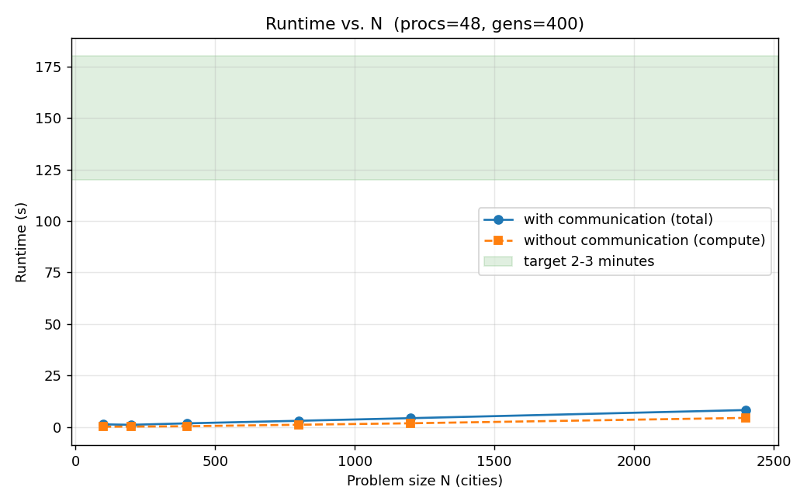
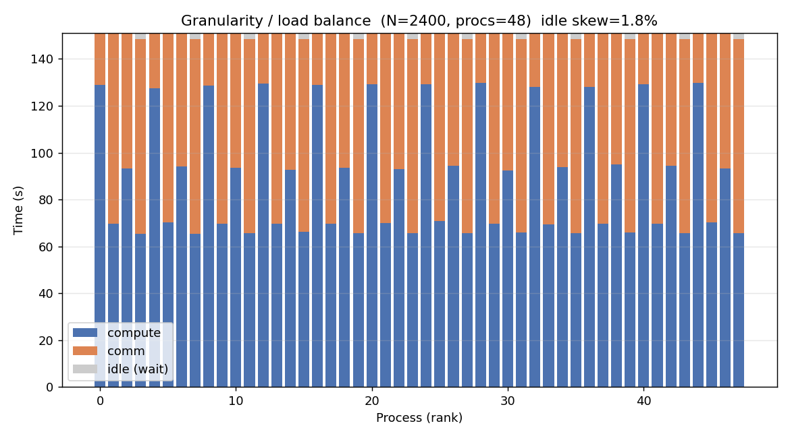
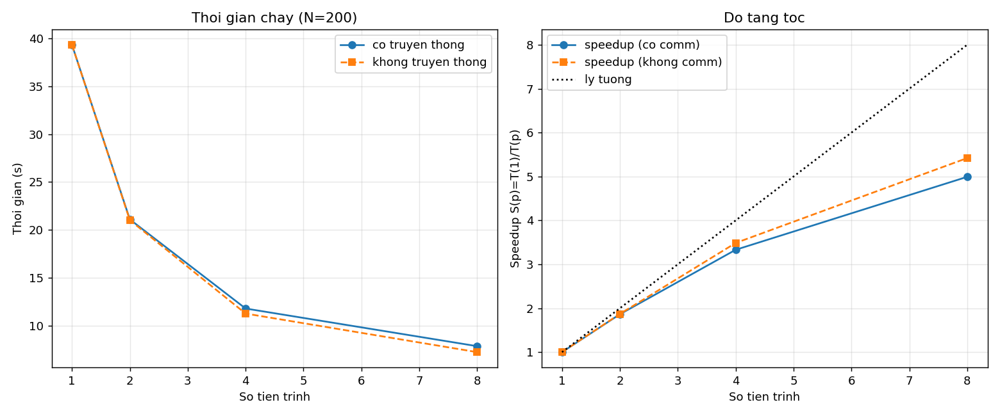
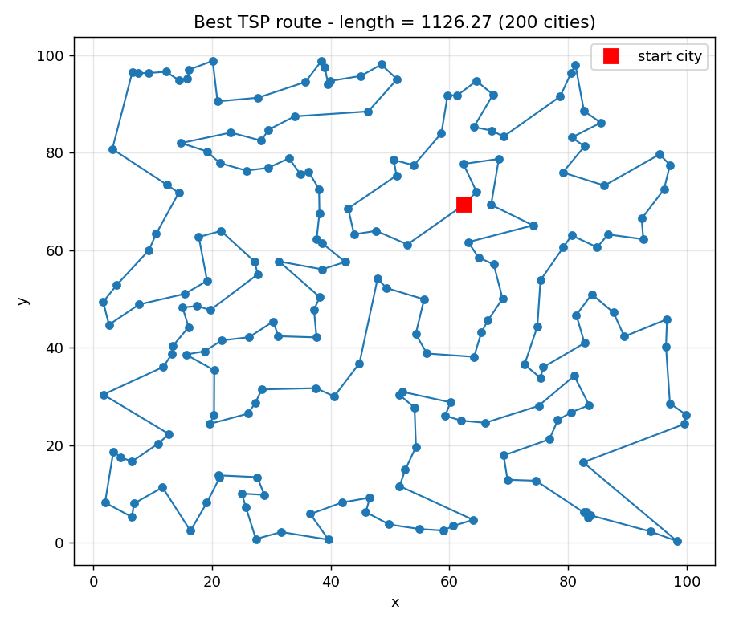
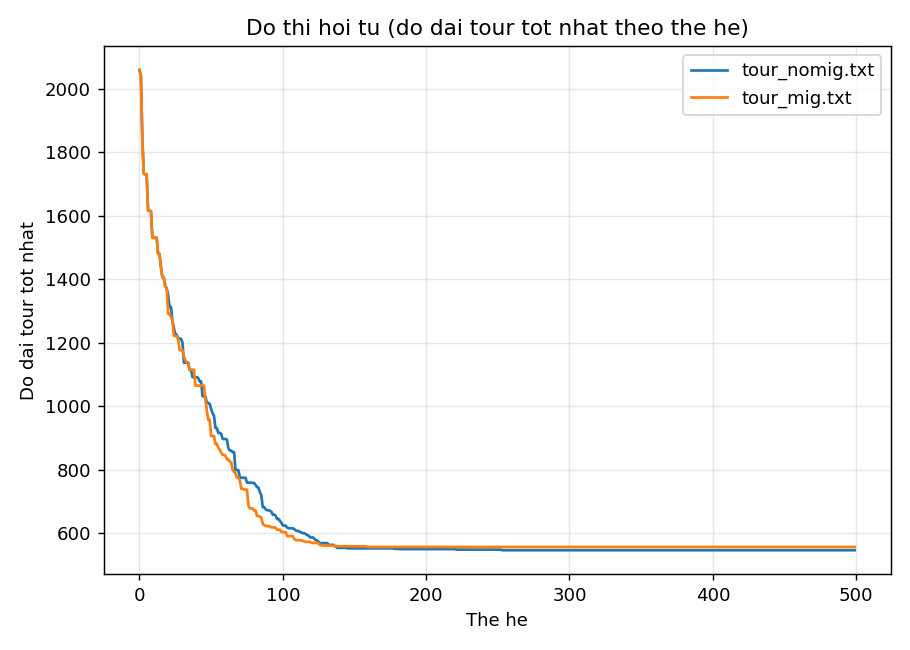

# Giải thuật Di truyền Mô hình Đảo cho Bài toán Người Giao Hàng trên Cụm MPI

**Môn:** Lập trình song song — Đồ án cuối kỳ
**Nhóm:** _(điền tên nhóm)_ — 4 thành viên
**Chủ đề:** Island-model Genetic Algorithm (GA) giải Travelling Salesman Problem (TSP),
song song hóa bằng MPI trên cụm máy thật nối qua Tailscale.

---

## Mục lục
1. Đặt vấn đề
2. Bài toán TSP và Giải thuật Di truyền tuần tự
3. Chiến lược song song hóa (mức độ, phân rã, ánh xạ, giao tiếp, cân bằng tải, mã giả)
4. Kiến trúc cụm MPI
5. Kết quả thực nghiệm (đúng đắn, kích thước N, độ mịn, speedup)
6. Khó khăn và cách khắc phục
7. Kết luận
8. Phụ lục: cách chạy lại

---

## 1. Đặt vấn đề

**TSP (Travelling Salesman Problem):** cho N thành phố và khoảng cách giữa chúng, tìm
một lộ trình khép kín đi qua **mỗi thành phố đúng một lần** sao cho **tổng quãng đường
ngắn nhất**. TSP là **NP-hard**: số lộ trình khả dĩ là (N−1)!/2; với N=50 đã là ~3×10⁶²
khả năng — không thể duyệt hết. Ta dùng **metaheuristic** (Giải thuật Di truyền) để tìm
nghiệm tốt trong thời gian chấp nhận được.

**Vì sao song song?** GA cần quần thể lớn và nhiều thế hệ → tốn thời gian. Mô hình **Đảo
(Island model)** chia quần thể thành nhiều đảo chạy **đồng thời** trên nhiều máy, định kỳ
**di cư** cá thể tốt giữa các đảo. Đây vừa là bài toán thú vị, vừa thể hiện kỹ thuật song
song hóa thật sự (không phải chia việc tầm thường).

---

## 2. Bài toán TSP và Giải thuật Di truyền tuần tự

### 2.1. Biểu diễn
- **Cá thể:** một hoán vị của `0..N−1` — thứ tự thăm các thành phố.
- **Fitness:** nghịch đảo độ dài lộ trình; tour càng ngắn càng tốt.
- **Độ dài tour:** tổng khoảng cách Euclid giữa các thành phố liên tiếp, khép kín.

### 2.2. Các toán tử di truyền
| Toán tử | Mô tả | Vì sao chọn |
|---|---|---|
| Khởi tạo | Sinh ngẫu nhiên các hoán vị | Đa dạng ban đầu |
| Chọn lọc giải đấu | Lấy ngẫu nhiên k cá thể, giữ tốt nhất | Áp lực chọn lọc điều chỉnh qua k |
| Lai ghép thứ tự (OX) | Giữ đoạn của cha 1, điền phần còn lại theo thứ tự cha 2 | Bảo toàn **hoán vị hợp lệ** |
| Đột biến (swap + đảo đoạn) | Đổi chỗ 2 thành phố / đảo một đoạn | Thoát cực trị cục bộ |
| Elitism | Giữ cá thể tốt nhất sang thế hệ sau | Nghiệm không bao giờ xấu đi |

### 2.3. Vòng tiến hóa tuần tự (mã giả)
```
khởi tạo quần thể ngẫu nhiên
lặp qua từng thế hệ:
    sắp xếp quần thể theo độ dài tour
    giữ lại cá thể tinh hoa
    lặp đến khi đủ quần thể mới:
        cha1, cha2 = chọn lọc giải đấu
        con = lai ghép OX(cha1, cha2); đột biến(con)
        thêm con vào quần thể mới
    cập nhật độ dài; ghi lại tour tốt nhất
```
Mã nguồn: `python/ga_core.py` và `cpp/ga_core.hpp` (cùng thuật toán, hai ngôn ngữ).

---

## 3. Chiến lược song song hóa

### 3.1. Mức độ song song & kỹ thuật phân rã
- **Mức độ song song: SONG SONG DỮ LIỆU (data parallelism).** Quần thể (dữ liệu) được
  chia cho nhiều tiến trình; mỗi tiến trình MPI = **một đảo** xử lý quần thể con của mình.
- **Kỹ thuật phân rã: HỖN HỢP (hybrid)** gồm:
  - **Phân rã dữ liệu (data decomposition):** tổng quần thể `P` chia đều `P/p` cá thể/đảo.
  - **Phân rã thăm dò (exploratory decomposition):** mỗi đảo là một cuộc tìm kiếm độc lập
    trong không gian nghiệm (seed khác nhau ⇒ khám phá vùng khác nhau).
- **Hạt (grain):** một đảo = một tác vụ; kích thước hạt = `P/p` cá thể × `gens` thế hệ.

### 3.2. Ánh xạ tiến trình (mapping technique)
- **Sơ đồ 1 chiều (1D):** `p` tiến trình xếp thành **vòng (ring)** rank `0..p−1`.
- **Gán: một đảo cho mỗi tiến trình** (1 process / island). Trên cụm, dùng cơ chế ánh xạ
  **tuần tự** (`--map-by seq`) để gán đảo cho từng máy theo hostfile (xem §6 — cần thiết
  cho phần cứng dị thể). Không dùng lưới 2D `n/√p × n/√p` vì giao tiếp chỉ là **láng giềng
  trên vòng**, không phải trao đổi khối ma trận 2D.

### 3.3. Chiến lược giao tiếp & topology
- **Topology: VÒNG (ring).** Láng giềng của rank `i`: trái `(i−1)%p`, phải `(i+1)%p`.
- **Di cư:** mỗi `K` thế hệ (mặc định K=20), mỗi đảo gửi **bản sao cá thể tốt nhất** sang
  phải, nhận từ trái, **thay cá thể tệ nhất** nếu khách tốt hơn.
```
   Đảo 0 ──► Đảo 1 ──► Đảo 2 ──┐
     ▲                          │
     └──────────────────────────┘   (vòng ring)
```
- **Kiểu giao tiếp: CHẶN nhưng an toàn — `MPI_Sendrecv`** (blocking, nhưng gửi+nhận đồng
  thời trong một lời gọi ⇒ **không deadlock** trên vòng). KHÔNG dùng non-blocking
  (`Isend/Irecv`) vì mỗi chu kỳ chỉ trao đổi một cá thể nhỏ, không cần chồng lấp tính toán.
- **KHÔNG phải master–slave** — đây là mô hình **ngang hàng (peer)**; không có tiến trình
  điều phối trung tâm.
- **Gom kết quả:** `MPI_Allreduce` với toán tử **`MPI_MINLOC`** tìm đồng thời (a) độ dài
  tour ngắn nhất toàn cục và (b) rank của đảo đạt được; đảo thắng gửi lộ trình về rank 0
  bằng `MPI_Send`/`MPI_Recv`.

### 3.4. Cân bằng tải (load balancing)
- **Cân bằng tĩnh, tự nhiên:** mọi đảo có cùng `P/p` cá thể và cùng số thế hệ ⇒ khối lượng
  tính toán gần bằng nhau. Không cần lập lịch động.
- Khi phần cứng **đồng nhất**, độ lệch thời gian rảnh ≈ 0% (xem §5.3). Khi phần cứng **dị
  thể** (CPU khác nhau), máy nhanh phải chờ máy chậm ở điểm di cư ⇒ mất cân bằng; cách
  chỉnh là **chia quần thể theo tốc độ máy** (máy nhanh nhận nhiều cá thể hơn) — xem §5.5.

### 3.5. Mã giả thuật toán SONG SONG
```
INPUT: cities, p (số tiến trình), G (gens), Pop (quần thể/đảo), K (chu kỳ di cư)
rank  = MPI_Comm_rank ; size = MPI_Comm_size
left  = (rank−1)%size ; right = (rank+1)%size
rng   = seed(BASE + rank*1000)            # mỗi đảo seed riêng
pop   = [random_tour() for _ in 1..Pop]
MPI_Barrier ; t0 = Wtime() ; comm_time = 0

for gen in 1..G:
    sort pop theo độ dài tour ; new = [elite]
    while |new| < Pop:
        p1,p2 = tournament_select(pop)
        child = OX(p1,p2) ; mutate(child) ; new.append(child)
    pop = new
    if K>0 and gen%K==0 and size>1:                 # DI CƯ vòng ring
        t=Wtime()
        recv = MPI_Sendrecv(best(pop) → right, ← left)
        comm_time += Wtime()−t
        if len(recv) < len(worst(pop)): thay worst bằng recv

MPI_Barrier ; elapsed = Wtime()−t0
(global_best, win) = MPI_Allreduce((best_local,rank), MINLOC)   # gom kết quả
nếu rank==win và win≠0: MPI_Send(tour → 0)
rank 0 in/lưu tour ; gom (compute,comm) mọi rank để vẽ biểu đồ
```
Mã nguồn song song: `python/tsp_island.py`, `cpp/tsp_island.cpp`.

### 3.6. Vì sao mô hình này hợp cụm mạng overlay?
Island-GA có **tỉ lệ tính/giao tiếp rất cao**: mỗi đảo tính nặng suốt K thế hệ rồi chỉ trao
đổi **một cá thể** (vài chục số nguyên) mỗi lần di cư ⇒ chịu được độ trễ mạng (Tailscale WAN).

---

## 4. Kiến trúc cụm MPI (thực tế đã dựng)

Nhóm dựng cụm **máy thật của các thành viên** nối qua **Tailscale** (VPN overlay: mỗi máy
một IP `100.x` cố định, xuyên NAT, hoạt động như một LAN ảo).

```
              Tailscale tailnet (100.x)
   ┌───────────┬───────────┬───────────┬───────────┐
 node1        node2        node3        node4
 WSL/Ubuntu   Ubuntu       macOS        WSL/Ubuntu
 (launcher)   (native)     (Apple)      (WSL)
```

- **OpenMPI 5.0.9** trên mọi node (yêu cầu khắt khe: cùng phiên bản launch-layer
  PMIx/PRRTE/hwloc — xem §6), `mpi4py` (Python) và `mpicxx` (C++).
- **SSH không mật khẩu** (khóa trong `cluster/authorized_keys`) để `mpirun` khởi chạy
  tiến trình từ xa; tên máy ánh xạ IP Tailscale trong `/etc/hosts`.
- Code đồng bộ qua `git` (nhánh `bao-dev`), cùng đường dẫn `~/parallel-tsp` mọi máy.
- Bộ khởi chạy: `cluster/run_cluster.sh` (phân tán) và `cluster/run_local.sh` (một máy).

Chi tiết dựng cụm: `cluster/DISTRIBUTE.md`, `docs/TASK_remote_tailscale_guide.md`.

> **Lưu ý:** macOS (node3) chạy được bản **một máy** nhưng **không tham gia cụm MPI** được
> (lý do kỹ thuật ở §6). Các phép đo cụm dùng các node Linux/WSL.

---

## 5. Kết quả thực nghiệm

> Đo trên: **node1** = WSL Ubuntu, AMD Ryzen 7 4800HS (16 luồng); **node2** = Ubuntu
> native, Intel i5-11400H (12 luồng); nối qua Tailscale. OpenMPI 5.0.9 + mpi4py. Sinh số
> liệu bằng `python/experiments.py`; biểu đồ trong `results/exp_*.png`.

### 5.1. Kiểm tra TÍNH ĐÚNG ĐẮN của nghiệm song song
- Nghiệm in ra luôn là **một hoán vị hợp lệ** của `0..N−1`: mỗi thành phố xuất hiện **đúng
  một lần**, tour khép kín (kiểm tra bằng `sorted(tour) == [0..N−1]`).
- Khi chạy với `-np 1`, kết quả **trùng** với bản tuần tự `tsp_sequential.py` (cùng seed)
  ⇒ tầng song song không làm sai thuật toán.
- Toán tử **OX** bảo toàn hoán vị nên con lai không bao giờ trùng/thiếu thành phố.
→ Chương trình song song cho ra **đúng dạng lời giải** của TSP.

### 5.2. Xác định kích thước dữ liệu N (mục tiêu thời gian chạy 2–3 phút)
Đặt **số tiến trình = số nhân** dùng để đo, biến thiên N (số thành phố), đo thời gian chạy
**có** và **không** tính thời gian truyền thông (`results/exp_size.csv`, `exp_size.png`):

| N | Tổng (s) | Không-comm (s) | Comm (s) |
|---|---|---|---|
| 100 |  7.15 |  6.80 | 0.345 |
| 200 | 10.42 | 10.00 | 0.416 |
| 400 | 16.71 | 16.11 | 0.604 |
| 800 | 29.66 | 28.96 | 0.696 |

Thời gian tăng theo N; comm gần như phẳng (di cư chỉ gửi 1 cá thể/chu kỳ). Ngoại suy xu
hướng, để chạm **2–3 phút (120–180 s)** cần **N ≈ 4000–5000** (giữ gens=400). → Chọn
**N = 5000** cho bài đo chính; phần speedup dùng **2N = 10000**.



### 5.3. Kiểm tra độ mịn (granularity) & cân bằng tải
Chạy tại N với **số tiến trình = số nhân**, vẽ **thời gian từng tiến trình** (compute và
comm khác màu, cột chồng) — `results/exp_gran.png`, `exp_gran.csv`.

**Phần cứng đồng nhất (8 tiến trình trên node1):** compute ~12–14 s/đảo, comm 0.1–1.5 s,
**độ lệch thời gian rảnh = 0.0%** (≤ 25%) ⇒ **hệ cân bằng tốt**, không cần chỉnh độ mịn.



### 5.4. Độ tăng tốc (speedup) — có và không có thời gian truyền thông
Giữ **tổng quần thể cố định** (strong scaling), biến số tiến trình 1, 2, 4, 8; mỗi mốc đo
thời gian **có** và **không** comm (`results/exp_speedup.csv`, `exp_speedup.png`):

| p | Tổng (s) | Comm (s) | Speedup (có comm) | Speedup (không comm) | Efficiency |
|---|---|---|---|---|---|
| 1 | 39.32 | 0.002 | 1.00 | 1.00 | 100% |
| 2 | 21.10 | 0.076 | 1.86 | 1.87 |  93% |
| 4 | 11.80 | 0.526 | 3.33 | 3.49 |  83% |
| 8 |  7.88 | 0.622 | 4.99 | 5.42 |  62% |

- Speedup gần tuyến tính ở 2–4 tiến trình; tới 8 đạt **~5×**.
- Đường "không comm" cao hơn ⇒ **chi phí truyền thông** + phần tuần tự (sort/elitism + gom
  kết quả) làm efficiency giảm khi `p` tăng — đúng **định luật Amdahl**. Khớp bình phương
  tối thiểu cho phần tuần tự `s ≈ 0.1`.



### 5.5. Chạy PHÂN TÁN THẬT trên 2 máy (node1 WSL + node2 native, qua Tailscale)
Kết quả "cụm thật" (`results/exp_*_n12.{csv,png}`):

| p | Tổng (s) | **Comm (s)** | Speedup | Efficiency |
|---|---|---|---|---|
| 1 (node1) | 20.38 | 0.004 | 1.00 | 100% |
| 2 (node1+node2) | 10.26 | **2.34** | **1.99** | **99%** |

Khác biệt then chốt so với 1 máy: **thời gian truyền thông là THẬT (2.34 s)** = chi phí
mạng Tailscale WAN (so với ~0 khi chạy 1 máy). Speedup 1.99 / efficiency 99% vì di cư thưa.

**Quan sát cân bằng tải trên phần cứng KHÁC NHAU** (`exp_gran_n12.png`):
- node1 (WSL, Ryzen 7): compute 8.15 s, comm 0.39 s
- node2 (native, i5):   compute **4.86 s** (nhanh hơn), comm **3.68 s** (chờ nhiều hơn)

node2 tính nhanh hơn nên **phải chờ** node1 tại điểm di cư (`Sendrecv` đồng bộ) — minh hoạ
thực tế của **mất cân bằng do phần cứng dị thể**. Cách chỉnh độ mịn: **chia quần thể theo
tốc độ máy** (máy nhanh nhận nhiều cá thể hơn) thay vì chia đều.

### 5.6. Chất lượng nghiệm: di cư có lợi không?
Bài 50 thành phố, 500 thế hệ, 3 đảo, 5 seed/chế độ:

| | Có di cư (K=20) | Không di cư |
|---|---|---|
| Trung bình độ dài tour | 561.3 | 545.7 |

**Phát hiện:** sau khi sửa lỗi chọn lọc (§6), di cư ring **tham lam** (luôn gửi cá thể tốt
nhất) **không cải thiện** mà còn tệ hơn ~2.9% — vì làm **giảm đa dạng** giữa các đảo → hội
tụ sớm. Đây là đánh đổi **khai thác ↔ khám phá** kinh điển. Ở bản code **trước khi sửa lỗi**,
di cư "trông như" có lợi lớn vì nó là cơ chế truyền nghiệm **duy nhất** — minh chứng tầm
quan trọng của **kiểm thử từng thành phần**. Hướng cải thiện: tăng K, di cư có điều kiện,
hoặc di cư cá thể đa dạng thay vì luôn là tốt nhất.




---

## 6. Khó khăn và cách khắc phục

| Khó khăn | Nguyên nhân | Cách khắc phục |
|---|---|---|
| Deadlock khi di cư | `Send`/`Recv` chặn lẫn nhau trên vòng | `MPI_Sendrecv` (gửi+nhận đồng thời) |
| Con lai không hợp lệ | Lai ghép 1 điểm phá vỡ hoán vị | Order Crossover (OX) bảo toàn hoán vị |
| GA hội tụ chậm bất thường | **Lỗi:** sau khi sắp xếp `pop`, mảng `lengths` không sắp theo ⇒ chọn lọc so nhầm fitness | Sắp `lengths` cùng `pop`; tour tốt nhất cải thiện ~33% |
| `mpirun` treo đa máy | SSH còn hỏi mật khẩu | SSH không mật khẩu (khóa chung) |
| **Sai phiên bản launch-layer** | OpenMPI khác bản / PMIx-PRRTE khác | Dựng **OpenMPI 5.0.9 từ nguồn** cho khớp mọi node |
| **node2 bị loại khỏi mapping** ("lacks topology") | OpenMPI build với **hwloc bundled** ≠ node1 ⇒ topology không unpack được | Build lại `--with-hwloc=/usr` (hwloc hệ thống) |
| **CPU khác nhau** (16 vs 12 luồng) | Mapper nhận diện topology dị thể rồi loại node | Dùng `--map-by seq --bind-to none` (bỏ phụ thuộc topology) |
| **macOS không vào được cụm** | Card Tailscale của mac là `utun*` (point-to-point) — OpenMPI **không liệt kê**; LAN lại khác mạng vật lý | Không khắc phục được ở mức cấu hình; mac chỉ chạy **một máy** (`run_local.sh`) |
| Mất cân bằng tải máy dị thể | Chia quần thể đều nhưng CPU khác tốc độ | Chia quần thể theo tốc độ máy (hướng cải thiện) |

---

## 7. Kết luận
- Dựng được **cụm MPI máy thật qua Tailscale** và chạy Island-GA **phân tán** (node1+node2),
  cùng bản chạy **một máy** trên mọi node kể cả macOS.
- Cài đặt Island-GA cho TSP ở **hai ngôn ngữ** (Python + C++), cùng thuật toán.
- **Đúng đắn:** nghiệm là hoán vị hợp lệ, trùng bản tuần tự khi p=1.
- **Speedup:** ~5× ở 8 tiến trình (1 máy); **1.99× / 99%** trên **2 máy thật** với chi phí
  mạng thật 2.34 s. Cân bằng tải tốt khi phần cứng đồng nhất; lệch khi dị thể (đã phân tích).
- **Phát hiện:** với chọn lọc đã sửa đúng, di cư ring tham lam **hơi hại** chất lượng — lợi
  ích ở bản cũ là **giả** do lỗi chọn lọc. Bài học: kiểm thử từng thành phần.
- **Mở rộng:** chia quần thể theo tốc độ máy; di cư có điều kiện/đa dạng; cấu trúc sao/lưới
  2D; tăng N; lai 2-opt/Lin–Kernighan.

---

## 8. Phụ lục: Cách chạy lại
```bash
# Test lõi GA tuần tự
cd python && python3 -m pytest test_ga_core.py -v

# Chạy MỘT MÁY (mọi node, kể cả macOS) — tự dò OpenMPI + python có mpi4py
bash cluster/run_local.sh 4 data/cities_50.txt --gens 500 --migrate 20

# Chạy PHÂN TÁN trên cụm (từ node1) — bộ khởi chạy đặt sẵn cờ cần thiết
bash cluster/run_cluster.sh cluster/hosts.cur 2 \
    python3 python/tsp_island.py data/cities_50.txt --gens 500 --migrate 20

# Sinh số liệu + biểu đồ cho báo cáo
python3 python/experiments.py size    --procs 4 --sizes 100 200 400 800 --hostfile cluster/hosts.cur
python3 python/experiments.py gran    --procs 4 --size 200 --hostfile cluster/hosts.cur
python3 python/experiments.py speedup --procs 1 2 4 8 --size 200 --hostfile cluster/hosts.cur
```
Bản C++ tương đương trong `cpp/` (biên dịch `mpicxx -O2 -o tsp_island tsp_island.cpp`).
